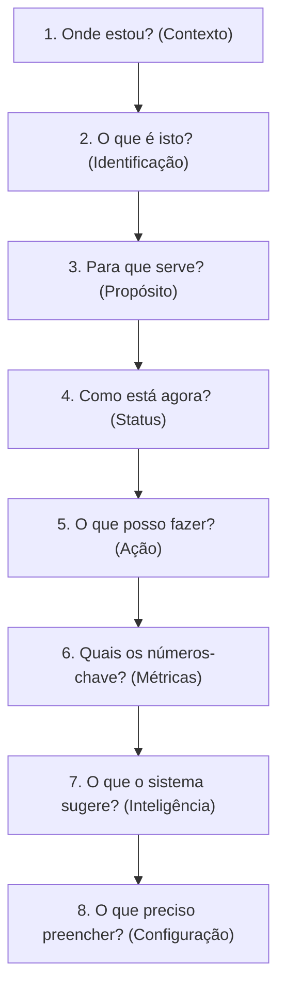

Every page in Zapfy should follow the hierarchy and visual pattern outlined below.
Original file: /Users/jadercorrea/workspace/zapfy/docs/prod/concepts/page-pattern.md

# Page Hierarchy Pattern — Portal Dashboard Reference

Padrão visual e cognitivo de hierarquia de informação aplicado a todas as páginas e painéis do portal Zapfy.
Use este documento como referência ao criar ou refatorar painéis para garantir consistência e reduzir a carga cognitiva do usuário.

---

## 1. O Fluxo Cognitivo & Blueprint

A hierarquia de página do Zapfy não é apenas estética; ela espelha a sequência natural do pensamento do usuário. Antes de agir, o cérebro humano precisa responder a perguntas básicas em uma ordem específica. Inverter essa ordem aumenta a carga cognitiva e prejudica a experiência de uso.

### Sequência de Perguntas Naturais do Usuário



### O Blueprint Visual da Página

| **CMD Header — Lado Esquerdo (`.cmd__left`)** | **CMD Header — Lado Direito (`.cmd__right`)** |
| :--- | :--- |
| **1. Contexto** (`.cmd__crumbs`) <br> *Pergunta: "Onde estou?"* | **5. Ação** (`.cmd__actions`) <br> *Pergunta: "O que posso fazer agora?"* |
| **2. Identificação** (`.cmd__title`) <br> *Pergunta: "O que é isto?"* | |
| **3. Propósito** (`.cmd__subtitle`) <br> *Pergunta: "Para que serve?"* | **6. Métricas** (`.cmd__kpis`) <br> *Pergunta: "Quais são os números-chave?"* |
| **4. Status & URL** (`.cmd__chips` / `.cmd__url`) <br> *Pergunta: "Como está agora?"* | |

---

| **Conteúdo Principal — Coluna Inteligência (Esquerda)** | **Conteúdo Principal — Coluna Configuração (Direita)** |
| :--- | :--- |
| **7. Inteligência** (Insights / Copiloto) <br> *Pergunta: "O que o sistema sugere?"* | **8. Configuração** (Formulários / Dados) <br> *Pergunta: "O que preciso preencher?"* |

---

## 2. Níveis da Hierarquia & Componentes

Cada nível cognitivo possui um componente dedicado no Zapfy Design System (DS).

### Nível 1: Contexto
* **Pergunta do Usuário:** *"Onde estou na navegação?"*
* **Descrição:** Breadcrumbs estruturados que guiam e situam o usuário antes de qualquer interação.
* **Componente DS:** `.cmd__crumbs`
* **Arquivo CSS:** `cmd-header.css`

### Nível 2: Identificação
* **Pergunta do Usuário:** *"O que é esta página?"*
* **Descrição:** Título H1 proeminente com peso visual marcante (peso 800, tamanho 28px, tracking negativo) para capturar a atenção imediata.
* **Componente DS:** `.cmd__title`
* **Arquivo CSS:** `cmd-header.css`

### Nível 3: Propósito
* **Pergunta do Usuário:** *"Para que serve?"*
* **Descrição:** Subtítulo curto e em tom neutro que descreve o objetivo da tela em uma única linha.
* **Componente DS:** `.cmd__subtitle`
* **Arquivo CSS:** `cmd-header.css`

### Nível 4: Status
* **Pergunta do Usuário:** *"Como está agora?"*
* **Descrição:** Chips não interativos (apenas leitura) com indicadores coloridos comunicando o estado do recurso de forma instantânea.
* **Componente DS:** `.chip` + `.chip__dot--ok | --warn | --error`
* **Arquivo CSS:** `chip.css`

### Nível 5: Ação (Topo)
* **Pergunta do Usuário:** *"O que posso fazer agora?"*
* **Descrição:** Chamadas para ação (CTAs) principais localizadas no canto superior direito. Ação primária ganha destaque (`btn-primary`), seguidas de secundárias ou fantasmas (`btn-secondary`, `btn-ghost`).
* **Componente DS:** `.cmd__actions` (dentro de `.cmd__right`)
* **Arquivo CSS:** `cmd-header.css` + `buttons.css`

### Nível 6: Métricas
* **Pergunta do Usuário:** *"Quais são os números-chave?"*
* **Descrição:** Indicadores-chave de desempenho (KPIs) dispostos em grid horizontal compacto alinhados à direita, contendo valor em destaque, descrição curta e dica de contexto opcional.
* **Componente DS:** `.kpi-row` > `.kpi-card` (dentro de `.cmd__kpis`)
* **Arquivo CSS:** `kpi-row.css`

### Nível 7: Inteligência
* **Pergunta do Usuário:** *"O que o sistema sugere?"*
* **Descrição:** Insights automáticos do Copiloto, sugestões acionáveis ou alertas que auxiliam o usuário a tomar decisões melhores. Fica posicionado no grid principal do corpo do painel.
* **Componente DS:** Copiloto/Insights Grid (padrão de interface)
* **Arquivo CSS:** Customizado (conforme layout)

### Nível 8: Configuração
* **Pergunta do Usuário:** *"O que preciso preencher?"*
* **Descrição:** Área de controle, edição de dados e preenchimento de formulários. Pode utilizar componentes de passo a passo para reduzir a complexidade.
* **Componente DS:** `.form-step` + Stepper
* **Arquivo CSS:** `forms.css` + `stepper.css`

---

## 3. Estrutura HTML de Referência

Abaixo está o esqueleto HTML padrão utilizado para montar uma página seguindo fielmente a hierarquia de 8 níveis.

```html
<div class="cmd">
  <!-- COLUNA DA ESQUERDA (Níveis 1 a 4) -->
  <div class="cmd__left">
    <!-- Nível 1: Contexto (Breadcrumbs) -->
    <div class="cmd__crumbs">
      <a href="/dashboard">Painel</a>
      <span class="cmd__crumbs-sep">/</span>
      <span>Sua Loja</span>
    </div>
    
    <!-- Nível 2: Identificação (Título) -->
    <h1 class="cmd__title">Configure Sua Loja</h1>
    
    <!-- Nível 3: Propósito (Subtítulo) -->
    <p class="cmd__subtitle">Configure identidade, acompanhe métricas e compartilhe sua loja online.</p>
    
    <!-- Nível 4: Status & URL -->
    <div class="cmd__chips">
      <span class="chip"><span class="chip__dot chip__dot--ok"></span> Loja Ativa</span>
      <span class="chip"><span class="chip__dot chip__dot--ok"></span> Mercado Livre</span>
      <span class="chip"><span class="chip__dot chip__dot--warn"></span> GPT Shop</span>
    </div>
    <div class="cmd__url">
      <span class="cmd__url-pill">shop.zapfy.ai/sua-loja</span>
    </div>
  </div>
  
  <!-- COLUNA DA DIREITA (Níveis 5 e 6) -->
  <div class="cmd__right">
    <!-- Nível 5: Ação (CTAs) -->
    <div class="cmd__actions">
      <a class="btn btn-secondary" href="#">Ver loja</a>
      <a class="btn btn-primary" href="#">Publicar</a>
    </div>
    
    <!-- Nível 6: Métricas (KPIs) -->
    <div class="cmd__kpis">
      <div class="kpi-row kpi-row--compact">
        <div class="kpi-card">
          <div class="kpi-card__num">42</div>
          <div class="kpi-card__label">Produtos ativos</div>
        </div>
        <div class="kpi-card">
          <div class="kpi-card__num">R$ 1.280</div>
          <div class="kpi-card__label">Vendas hoje</div>
        </div>
        <div class="kpi-card">
          <div class="kpi-card__num">156</div>
          <div class="kpi-card__label">Visitantes</div>
        </div>
      </div>
    </div>
  </div>
</div>
```

---

## 4. Tabela de Mapeamento do Design System

| Nível | Componente DS | Arquivo CSS |
| :---: | :--- | :--- |
| **1-5** | `.cmd` (Header Completo) | `cmd-header.css` |
| **4** | `.chip` + `.chip__dot` | `chip.css` |
| **6** | `.kpi-row` + `.kpi-card` | `kpi-row.css` |
| **7** | Insights / Copiloto | Padrão UI (Sem CSS dedicado fixo) |
| **8** | `.form-step` + Stepper | `forms.css` + `stepper.css` |

---

## 5. Checklist para Criação/Refatoração de Página

Ao desenvolver ou validar uma nova página de painel, verifique se todos os itens abaixo foram contemplados:

- [ ] **Nível 1 (Contexto):** Breadcrumbs (`.cmd__crumbs`) estão presentes e atualizados de acordo com a rota do usuário.
- [ ] **Nível 2 (Identificação):** Título H1 (`.cmd__title`) curto, claro e com peso visual adequado.
- [ ] **Nível 3 (Propósito):** Subtítulo (`.cmd__subtitle`) em tom muted, limitado a apenas uma linha explicativa.
- [ ] **Nível 4 (Status):** Status principais exibidos em `.chip` com dot indicador de cor adequada (verde, amarelo ou vermelho), apenas leitura.
- [ ] **Nível 5 (Ações):** Botões principais agrupados no canto superior direito (`.cmd__actions`), ordenados por relevância visual (primário sempre à direita).
- [ ] **Nível 6 (Métricas):** KPIs importantes do contexto da página exibidos em formato horizontal compacto (`.kpi-row--compact`).
- [ ] **Ordem dos Elementos:** A estrutura do HTML respeita a hierarquia do fluxo cognitivo (não subverter a ordem dos níveis).
